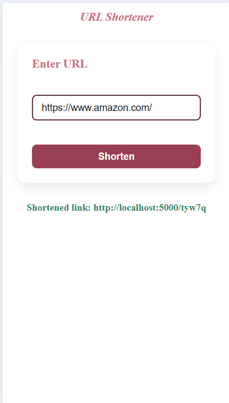

# URL Shortener

This is a simple web application I built that allows users to shorten long URLs into a unique code format like `localhost:5000/abcd`. Once generated, that short link can be shared and accessed to redirect to the original site.

---

## What it Does

- Takes a user-entered link from the frontend (`Compress.jsx`)
- Validates it on the client side
- Sends it to the backend (`/check` route)
- Backend generates a unique short code (like `a1b2c`) using a random string
- Checks MongoDB (native driver) to avoid duplicates and stores mapping
- Returns the shortened link to the frontend
- You can also access `/:id` which redirects to the original link using the code

---

## Tech Stack

### Frontend:
- React.js

### Backend:
- Node.js + Express
- MongoDB (using native MongoDB driver, not Mongoose)

## Screenshots

### Homepage

### Mobile view

### Redirection on Short Link

